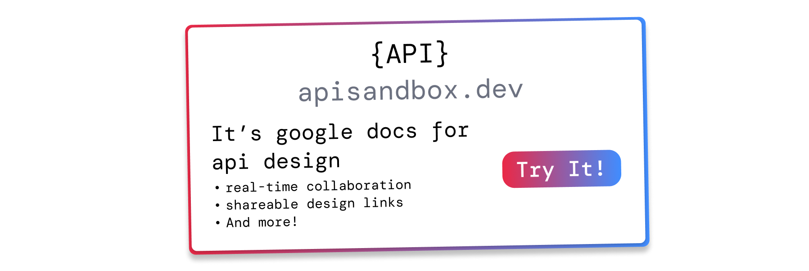

<p align="center">
  
  <h1 align="center">nestjs-zod</h1>
  <p align="center">
    ✨ A seamless validation solution for your NestJS application ✨
      <br/>
      by <a href="https://x.com/benlorantfy">@benlorantfy</a>
  </p>
</p>
<br/>
<p align="center">
  <a href="https://github.com/BenLorantfy/nestjs-zod/actions?query=branch%3Amain">
    
  </a>
  <a href="https://opensource.org/licenses/MIT" rel="nofollow">
    
  </a>
  <a href="https://www.npmjs.com/package/nestjs-zod" rel="nofollow">
    
  </a>
  <a href="https://www.npmjs.com/package/nestjs-zod" rel="nofollow">
    
  </a>
  <a href="https://x.com/benlorantfy">
    
  </a>
</p>

## Core Library Features

<p>
✨ Create nestjs DTOs from zod schemas
</p>
<p>
✨ Validate / parse request body, query params, and url params using zod
</p>
<p>
✨ Serialize response bodies using zod
</p>
<p>
✨ Automatically generate OpenAPI documentation using zod
</p>
<p>
✨ Supports zod codecs
</p>


<h3 align="center">Sponsored by: apisandbox.dev</h3>

<a href="https://apisandbox.dev/">
  
</a>
<a href="https://github.com/sponsors/BenLorantfy">
  
</a>


## Getting Started

### Automatic Setup
`nestjs-zod` can be automatically setup by running the following command:
```bash
npx nestjs-zod-cli /path/to/nestjs/project
```
This command runs a codemod that adds the validation pipe, serialization interceptor, http exception filter, and swagger cleanup function

Alternatively, you can follow the manual setup steps below

### Manual Setup

1. Install the package:
    ```bash
    npm install nestjs-zod # Note: zod ^3.25.0 || ^4.0.0 is also required
    ```
2. Add `ZodValidationPipe` to the `AppModule`
    <details>
      <summary>
        Show me how
      </summary>

    `ZodValidationPipe` is required in order to validate the request body, query, and params

    ```diff
    + import { APP_PIPE } from '@nestjs/core';
    + import { ZodValidationPipe } from 'nestjs-zod';

    @Module({
      imports: [],
      controllers: [AppController],
      providers: [
    +    {
    +      provide: APP_PIPE,
    +      useClass: ZodValidationPipe,
    +    },
      ]
    })
    export class AppModule {}
    ```
    </details>

3. Add `ZodSerializerInterceptor` to the `AppModule`
    <details>
      <summary>
        Show me how
      </summary>

    `ZodSerializerInterceptor` is required in order to validate the response bodies

    ```diff
    - import { APP_PIPE } from '@nestjs/core';
    + import { APP_PIPE, APP_INTERCEPTOR } from '@nestjs/core';
    - import { ZodValidationPipe } from 'nestjs-zod';
    + import { ZodValidationPipe, ZodSerializerInterceptor } from 'nestjs-zod';

    @Module({
      imports: [],
      controllers: [AppController],
      providers: [
        {
          provide: APP_PIPE,
          useClass: ZodValidationPipe,
        },
    +    {
    +      provide: APP_INTERCEPTOR,
    +      useClass: ZodSerializerInterceptor,
    +    },
      ]
    })
    export class AppModule {}
    ```
    </details>

4. [OPTIONAL] Add an `HttpExceptionFilter` 
    <details>
      <summary>
        Show me how
      </summary>

    An `HttpExceptionFilter` is required in order to add custom handling for zod errors

    ```diff
    - import { APP_PIPE, APP_INTERCEPTOR } from '@nestjs/core';
    + import { APP_PIPE, APP_INTERCEPTOR, APP_FILTER } from '@nestjs/core';
    import { ZodValidationPipe, ZodSerializerInterceptor } from 'nestjs-zod';
    + import { HttpExceptionFilter } from './http-exception.filter';

    @Module({
      imports: [],
      controllers: [AppController],
      providers: [
        {
          provide: APP_PIPE,
          useClass: ZodValidationPipe,
        },
        {
          provide: APP_INTERCEPTOR,
          useClass: ZodSerializerInterceptor,
        },
        {
          provide: APP_FILTER,
          useClass: HttpExceptionFilter,
        }
      ]
    })
    export class AppModule {}

    + // http-exception.filter
    + @Catch(HttpException)
    + export class HttpExceptionFilter extends BaseExceptionFilter {
    +     private readonly logger = new Logger(HttpExceptionFilter.name);
    + 
    +     catch(exception: HttpException, host: ArgumentsHost) {
    +         if (exception instanceof ZodSerializationException) {
    +             const zodError = exception.getZodError();
    +             if (zodError instanceof ZodError) {
    +                 this.logger.error(`ZodSerializationException: ${zodError.message}`);
    +             }
    +         }
    + 
    +         super.catch(exception, host);
    +     }
    + }
    ```
    </details>


5. [OPTIONAL] Add `cleanupOpenApiDoc`

    > **Important**: This step is important if using `@nestjs/swagger`

    <details>
      <summary>
        Show me how
      </summary>

    `cleanupOpenApiDoc` is required if using `@nestjs/swagger` to properly post-process the OpenAPI doc

    ```diff
    - SwaggerModule.setup('api', app, openApiDoc);
    + SwaggerModule.setup('api', app, cleanupOpenApiDoc(openApiDoc));
    ```

    </details>

Check out the [example app](./packages/example/) for a full example of how to integrate `nestjs-zod` in your nestjs application

## Documentation

- [Request Validation](#request-validation)
  - [`createZodDto` (Create a DTO from a Zod schema)](#createzoddto-create-a-dto-from-a-zod-schema)
  - [`ZodValidationPipe` (Get nestjs to validate using zod)](#zodvalidationpipe-get-nestjs-to-validate-using-zod)
  - [`createZodValidationPipe` (Creating custom validation pipe)](#createzodvalidationpipe-creating-custom-validation-pipe)
  - [`ZodValidationException`](#zodvalidationexception)
  - [`ZodSchemaDeclarationException`](#zodschemaDeclarationexception)
- [Response Validation](#response-validation)  
  - [`ZodSerializerDto` (Set zod DTO to serialize responses with)](#zodserializerdto-set-zod-dto-to-serialize-responses-with)
  - [`ZodSerializerInterceptor` (Get nestjs to serialize responses with zod)](#zodserializerinterceptor-get-nestjs-to-serialize-responses-with-zod)
  - [`createZodSerializerInterceptor` (Creating custom serializer interceptor)](#createzodserializerinterceptor-creating-custom-serializer-interceptor)
  - [`ZodResponse` (Sync run-time, compile-time, and docs-time schemas)](#zodresponse-sync-run-time-compile-time-and-docs-time-schemas)
  - [`ZodSerializationException`](#zodserializationexception)
- [OpenAPI (Swagger) support](#openapi-swagger-support)
  - [`cleanupOpenApiDoc` (Ensure proper OpenAPI output)](#cleanupopenapidoc-ensure-proper-openapi-output)
  - [Output schemas](#output-schemas)
  - [Codecs](#codecs)
  - [Reusable schemas](#reusable-schemas)
  - [`zodV3ToOpenAPI` (⚠️ DEPRECATED)](#zodv3toopenapi-deprecated)
- [`validate` (⚠️ DEPRECATED)](#validate-deprecated)
- [`ZodGuard` (⚠️ DEPRECATED)](#zodguard-deprecated)
  - [`createZodGuard` (Creating custom guard)](#createzodguard-creating-custom-guard)
- [`@nest-zod/z` (⚠️ DEPRECATED)](#nest-zodz-deprecated)
  - [ZodDateString](#zoddatestring)
  - [ZodPassword](#zodpassword)

### Request Validation
#### `createZodDto` (Create a DTO from a Zod schema)
```ts
function createZodDto<TSchema extends UnknownSchema, TCodec extends boolean = false>(schema: TSchema, options?: { codec: TCodec }): ZodDto<TSchema, TCodec>;
```
Creates a nestjs DTO from a zod schema.  These zod DTOs can be used in place of `class-validator` / `class-transformer` DTOs. Zod DTOs are responsible for three things:

1. Providing a schema for `ZodValidationPipe` to validate incoming client data against
2. Providing a compile-time typescript type from the Zod schema
3. Providing an OpenAPI schema when using `nestjs/swagger`

> [!NOTE]
> For this feature to work, please ensure [`ZodValidationPipe`](#zodvalidationpipe-get-nestjs-to-validate-using-zod) is setup correctly

##### Parameters
- `schema` - A zod schema.  You can "bring your own zod", including zod v3 schemas, v4 schemas, zod mini schemas, etc.  The only requirement is that the schema has a method called `parse`
- `options`
  - `options.codec` - If set to `true`, then when serializing responses `nestjs-zod` will use `encode` instead of `parse`.  See more information about codecs in the [zod documentation](https://zod.dev/codecs)

##### Examples
###### Creating a zod DTO
```ts
import { createZodDto } from 'nestjs-zod'
import { z } from 'zod'

const CredentialsSchema = z.object({
  username: z.string(),
  password: z.string(),
})

// class is required for using DTO as a type
class CredentialsDto extends createZodDto(CredentialsSchema) {}
```
###### Using a zod DTO
```ts
@Controller('auth')
class AuthController {
  async signIn(@Body() credentials: CredentialsDto) {}
}
```

#### `ZodValidationPipe` (Get nestjs to validate using zod)

`ZodValidationPipe` is needed to ensure zod DTOs actually validate incoming request data when using `@Body()`, `@Params()`, or `@Query()` parameter decorators

When the data is invalid it throws a [ZodValidationException](#zodvalidationexception).

##### Example
###### Globally (recommended)

```ts
import { ZodValidationPipe } from 'nestjs-zod'
import { APP_PIPE } from '@nestjs/core'

@Module({
  providers: [
    {
      provide: APP_PIPE,
      useClass: ZodValidationPipe,
    },
  ],
})
export class AppModule {}
```

###### Locally
```ts
import { ZodValidationPipe } from 'nestjs-zod'

// controller-level
@UsePipes(ZodValidationPipe)
class AuthController {}

class AuthController {
  // route-level
  @UsePipes(ZodValidationPipe)
  async signIn() {}
}
```
#### `createZodValidationPipe` (Creating custom validation pipe)
```ts
export function createZodValidationPipe({ createValidationException, strictSchemaDeclaration }: ZodValidationPipeOptions = {}): ZodValidationPipeClass
```

Creates a custom zod validation pipe

##### Example
```ts
import { createZodValidationPipe } from 'nestjs-zod'

const MyZodValidationPipe = createZodValidationPipe({
  // provide custom validation exception factory
  createValidationException: (error: ZodError) =>
    new BadRequestException('Ooops'),
})
```

##### Parameters
- `params.createValidationException` - A callback that will be called with the zod error when a parsing error occurs.  Should return a new instance of `Error`
- `params.strictSchemaDeclaration` - If `true`, throws a [`ZodSchemaDeclarationException`](#zodschemaDeclarationexception) when the pipe encounters a parameter that is not typed with a nestjs-zod DTO. It's recommended to set this to `true` to ensure all request data is properly validated

#### `ZodValidationException`

If the zod request parsing fails, then `nestjs-zod` will throw a `ZodValidationException`, which will result in the following HTTP response:

```json
{
  "statusCode": 400,
  "message": "Validation failed",
  "errors": [
    {
      "code": "too_small",
      "minimum": 8,
      "type": "string",
      "inclusive": true,
      "message": "String must contain at least 8 character(s)",
      "path": ["password"]
    }
  ]
}
```

You can customize the exception and HTTP response by either `1)` creating a custom validation pipe using [`createZodValidationPipe`](#createzodvalidationpipe-creating-custom-validation-pipe) or `2)` handling `ZodValidationException` inside an [exception filter](https://docs.nestjs.com/exception-filters)

Here is an example exception filter:

```ts
@Catch(ZodValidationException)
export class ZodValidationExceptionFilter implements ExceptionFilter {
  catch(exception: ZodValidationException) {
    exception.getZodError() // -> ZodError
  }
}
```

#### `ZodSchemaDeclarationException`

If `strictSchemaDeclaration` is set to `true` in [`createZodValidationPipe`](#createzodvalidationpipe-creating-custom-validation-pipe) and a request parameter is not typed with a nestjs-zod DTO (e.g. using a primitive type like `string` or a class-validator DTO), then `nestjs-zod` will throw a `ZodSchemaDeclarationException`, which will result in the following HTTP response:

```json
{
  "statusCode": 500,
  "message": "Internal Server Error"
}
```

This is useful for catching cases during development where request data might not be properly validated. You can handle this exception in an [exception filter](https://docs.nestjs.com/exception-filters) if you want to customize the response:

```ts
@Catch(ZodSchemaDeclarationException)
export class ZodSchemaDeclarationExceptionFilter implements ExceptionFilter {
  catch(exception: ZodSchemaDeclarationException, host: ArgumentsHost) {
    const ctx = host.switchToHttp();
    const response = ctx.getResponse();
    response.status(500).json({
      statusCode: 500,
      message: 'Missing nestjs-zod schema declaration',
    });
  }
}
```

### Response Validation

#### `ZodSerializerDto` (Set zod DTO to serialize responses with)
```ts
function ZodSerializerDto(dto: ZodDto | UnknownSchema | [ZodDto] | [UnknownSchema])
```
Parses / serializes the return value of a controller method using the provided zod schema.  This is especially useful to prevent accidental data leaks.

> [!NOTE]
> Instead of `ZodSerializerDto`, consider using [`ZodResponse`](#zodresponse-sync-run-time-compile-time-and-docs-time-schemas), which has some improvements over `ZodSerializerDto`

> [!NOTE]
> For this feature to work, please ensure [`ZodSerializerInterceptor`](#zodserializerinterceptor-get-nestjs-to-serialize-responses-with-zod) is setup correctly

##### Parameters
- `options.dto` - A ZodDto (or zod schema) to serialize the response with.  If passed with array syntax (`[MyDto]`) then it will parse as an array.  Note that the array syntax does not work with [`zod/mini`](https://zod.dev/packages/mini), because it requires the schema have an `.array()` method

##### Example

```ts
const UserSchema = z.object({ username: string() })

class UserDto extends createZodDto(UserSchema) {}

@Controller('user')
export class UserController {
  constructor(private readonly userService: UserService) {}

  @ZodSerializerDto(UserDto)
  getUser(id: number) {
    return this.userService.findOne(id)
  }
}
```

In the above example, if the `userService.findOne` method returns `password`, the `password` property will be stripped out thanks to the `@ZodSerializerDto` decorator.

Also note that arrays can be serialized using `[]` syntax like this:
```ts
class BookDto extends createZodDto(z.object({ title: string() })) {}

@Controller('books')
export class BooksController {
  constructor() {}

  @ZodSerializerDto([BookDto])
  getBooks() {
    return [{ title: 'The Martian' }, { title: 'Hail Marry' }];
  }
}
```

Or by using an array DTO:
```ts
class BookListDto extends createZodDto(z.array(z.object({ title: string() }))) {}

@Controller('books')
export class BooksController {
  constructor() {}

  @ZodSerializerDto(BookListDto)
  getBooks() {
    return [{ title: 'The Martian' }, { title: 'Hail Marry' }];
  }
}
```


#### `ZodSerializerInterceptor` (Get nestjs to serialize responses with zod)

To ensure `ZodSerializerDto` works correctly, `ZodSerializerInterceptor` needs to be added to the `AppModule`

> [!NOTE]
> Also see [`ZodSerializationException`](#zodserializationexception) for information about customizing the serialization error handling

##### Example

This should be done in the `AppModule` like so:
```ts
@Module({
  ...
  providers: [
    ...,
    { provide: APP_INTERCEPTOR, useClass: ZodSerializerInterceptor },
  ],
})
export class AppModule {}
```

#### `createZodSerializerInterceptor` (Creating custom serializer interceptor)
```ts
export function createZodSerializerInterceptor({ reportInput }: ZodSerializerInterceptorOptions = {}): ZodSerializerInterceptorClass
```

Creates a custom zod serializer interceptor

##### Parameters
- `params.reportInput` - When set to `true`, includes the input value in Zod error issues. This is useful for debugging serialization errors. Only supported in Zod v4.

##### Example
```ts
import { createZodSerializerInterceptor } from 'nestjs-zod'
import { APP_INTERCEPTOR } from '@nestjs/core'

const CustomZodSerializerInterceptor = createZodSerializerInterceptor({
  reportInput: true,
})

@Module({
  providers: [
    {
      provide: APP_INTERCEPTOR,
      useClass: CustomZodSerializerInterceptor,
    },
  ],
})
export class AppModule {}
```

#### `ZodResponse` (Sync run-time, compile-time, and docs-time schemas)

```ts
function ZodResponse<TSchema extends UnknownSchema>({ status, description, type }: { status?: number, description?: string, type: ZodDto<TSchema> & { io: "input" } }): (target: object, propertyKey?: string | symbol, descriptor?: Pick<TypedPropertyDescriptor<(...args: any[]) => input<TSchema>|Promise<input<TSchema>>>, 'value'>) => void
function ZodResponse<TSchema extends RequiredBy<UnknownSchema, 'array'>>({ status, description, type }: { status?: number, description?: string, type: [ZodDto<TSchema> & { io: "input" }] }): (target: object, propertyKey?: string | symbol, descriptor?: Pick<TypedPropertyDescriptor<(...args: any[]) => Array<input<TSchema>>|Promise<Array<input<TSchema>>>>, 'value'>) => void
```

Consolidation of multiple decorators that allows setting the run-time, compile-time, and docs-time schema all at once

> [!NOTE]
> For this feature to work, please ensure [`ZodSerializerInterceptor`](#zodserializerinterceptor-get-nestjs-to-serialize-responses-with-zod) and [`cleanupOpenApiDoc`](#cleanupopenapidoc-ensure-proper-openapi-output) are setup correctly

##### Parameters
- `params.status` - Optionally sets the "happy-path" `status` of the response.  If provided, sets the status code using `@HttpCode` from `nestjs/common` and using `@ApiResponse` from `nestjs/swagger`
- `params.description` - Optionally sets a description of the response using `@ApiResponse`
- `params.type` - Sets the run-time (via `@ZodSerializerDto`), compile-time (via TypeScript), and docs-time (via `@ApiResponse`) response type.  

##### Example
You may find yourself duplicating type information:

```tsx
@ZodSerializer(BookDto)
@ApiOkResponse({
  status: 200,
  type: BookDto
})
getBook(): BookDto {
  ...
}
```
Here, `BookDto` is repeated 3 times:
1. To set the DTO to use to serialize 
2. To set the DTO to use for the OpenAPI documentation
3. To set the return type for the function

If these 3 spots get out of sync, this may cause bugs.  If you want to remove this duplication, you can consolidate using `ZodResponse`:
```diff
- @ZodSerializer(BookDto)
- @ApiOkResponse({
-  status: 200,
-  type: BookDto.Output
- })
- getBook(): BookDto {
+ @ZodResponse({ type: BookDto })
+ getBook()
  ...
}
```

`@ZodResponse` will set all these things.  It will set the DTO to use to serialize, it will set the DTO to use for the OpenAPI documentation, and it will throw a compile-time typescript error if the method does not return data that matches the zod input schema 

This is pretty powerful, because it ensures the run-time, compile-time, and docs-time representations of your response are all in sync.  For this reason, it's recommended to use `@ZodResponse` instead of repeating the DTO three times.


#### `ZodSerializationException`

If the zod response serialization fails, then `nestjs-zod` will throw a `ZodSerializationException`, which will result in the following HTTP response:

```json
{
  "message": "Internal Server Error",
  "statusCode": 500,
}
```

You can customize the exception and HTTP response handling `ZodSerializationException` inside an [exception filter](https://docs.nestjs.com/exception-filters)

See the example app [here](/packages/example/src/http-exception.filter.ts) for more information.

### OpenAPI (Swagger) support

> [!NOTE]
> For additional documentation, follow [Nest.js' Swagger Module Guide](https://docs.nestjs.com/openapi/introduction), or you can see the example application [here](/packages/example/)

If you have `@nestjs/swagger` setup, documentation will automatically be generated for:
- Request bodies, if you use `@Body() body: MyDto`
- Response bodies, if you use `@ApiOkResponse({ type: MyDto.Output })` (or [`@ZodResponse({ type: MyDto })`](#zodresponse-sync-run-time-compile-time-and-docs-time-schemas))
- Query params, if you use `@Query() query: MyQueryParamsDto`

To generate the OpenAPI document, `nestjs-zod` uses [`z.toJSONSchema`](https://zod.dev/json-schema) for zod v4 schemas.  It's recommended to review the zod documentation itself for more information about how the OpenAPI document is generated

For zod v3 schemas, `nestjs-zod` uses a custom-built (deprecated) function called `zodV3ToOpenAPI` that generates the OpenAPI document by inspecting the zod schema directly.

However, please ensure `cleanupOpenApiDoc` is setup correctly as detailed below

#### `cleanupOpenApiDoc` (Ensure proper OpenAPI output)
```ts
function cleanupOpenApiDoc(doc: OpenAPIObject, options?: { version?: '3.1' | '3.0' | 'auto' }): OpenAPIObject
```
Cleans up the generated OpenAPI doc by applying some post-processing

> [!NOTE]
> There used to be a function called `patchNestJsSwagger`.  This function has been replaced by `cleanupOpenApiDoc`

##### Parameters
- `doc` - The OpenAPI doc generated by `SwaggerModule.createDocument`
- `options.version` - The OpenAPI version to use while cleaning up the document. 
  - `auto` (default) - Uses the version specified in the OpenAPI document (The version in the OpenAPI can be changed by using the `setOpenAPIVersion` method on the swagger document builder).
  - `3.1` - Generates schemas that take advantage of OpenAPI 3.1 syntax.  See table below for more information
  - `3.0` - Generates schemas that are compatible with OpenAPI 3.0.  See table below for more information

|         | 3.0                                   | 3.1                                                |
|---------|---------------------------------------|----------------------------------------------------|
| null    | `{ type: 'string', nullable: true }`  | `{ anyOf: [{ type: 'string'}, { type: 'null' }] }` |
| literal | `{ type: 'string', enum: ['hello'] }` | `{ type: 'string', const: 'hello' }`               |

##### Example
To complete the swagger integration/setup, `cleanupOpenApiDoc` needs to be called with the generated open api doc, like so:

```diff
  const openApiDoc = SwaggerModule.createDocument(app, 
      new DocumentBuilder()
        .setTitle('Example API')
        .setDescription('Example API description')
        .setVersion('1.0')
        .build(),
  );
- SwaggerModule.setup('api', app, openApiDoc);
+ SwaggerModule.setup('api', app, cleanupOpenApiDoc(openApiDoc));
```

#### Output schemas

Note that `z.toJSONSchema` can generate two versions of any zod schema: "input" or "output".  This is what the [zod documentation](https://zod.dev/json-schema#io) says about this:

> Some schema types have different input and output types, e.g. ZodPipe, ZodDefault, and coerced primitives.

Note that by default, when generating OpenAPI documentation, `nestjs-zod` uses the "input" version of a schema, except for [`@ZodResponse`](#zodresponse-sync-run-time-compile-time-and-docs-time-schemas) which always generates the "output" version of a schema.  If you want to explicitly use the "output" version of a schema when generating OpenAPI documentation, you can use the `.Output` property of a zod DTO.  For example, this makes sense when using `@ApiResponse`:

```ts
@ApiResponse({
  type: MyDto.Output
})
```

However, it's recommended to use [`@ZodResponse`](#zodresponse-sync-run-time-compile-time-and-docs-time-schemas) over `@ApiResponse`, which automatically handles this for you:

```ts
@ZodResponse({
  type: MyDto // <-- No need to do `.Output` here
})
```
#### Codecs
Zod 4.1 introduced a new feature called "codecs".  There is more information about codecs in the [zod documentation](https://zod.dev/codecs)

`nestjs-zod` supports `codecs`.  If the `codec: true` option is used when creating the zod DTO, then `parse` will be used for request bodies, and `encode` will be used when serializing response bodies.

`codecs` can enable, in some cases, using _one_ zod schema, instead of two, for both the request and response

```ts
const stringToDate = z.codec(
  z.iso.datetime(),
  z.date(),
  {
    decode: (isoString) => new Date(isoString),
    encode: (date) => date.toISOString(),
  }
);

class BookDto extends createZodDto(z.object({
  title: z.string(),
  dateWritten: stringToDate
}), {
  codec: true
}) { }

@Controller('books')
class BookController {
  constructor() { }
  
  @Post()
  @ZodResponse({ 
    type: BookDto
  })
  createBook(@Body() book: BookDto) {
    return book;
  }
}
```
See the example app [here](/packages/example/src/people/people.dto.ts) for a full example.

#### Reusable schemas
You can also externalize and reuse schemas across multiple DTOs.  If you add `.meta({ id: "MySchema" })` to any zod schema, then that schema will be added directly to `components.schemas` in the OpenAPI documentation.  For example, this code:
```ts
const Author = z.object({ name: z.string() }).meta({ id: "Author" })

class BookDto extends createZodDto(z.object({ title: z.string(), author: Author })) { }
class BlogPostDto extends createZodDto(z.object({ title: z.string(), author: Author })) { }
```
Will result in this OpenAPI document:
```jsonc
{
  "components": {
    "schemas": {
      "Author": {
        // ...
      },
      "BookDto": {
        "type": "object",
        "properties": {
          "author": {
            "$ref": "#/components/schemas/Author"
          },
          "required": ["author"]
        }
      },
      "BlogPostDto": {
        "type": "object",
        "properties": {
          "author": {
            "$ref": "#/components/schemas/Author"
          },
          "required": ["author"]
        }
      }
    }
  },
  // ...
}
```

##### Schema names
Note that schemas are named / displayed in SwaggerUI according to the following logic:
1. For input schemas, (e.g. schemas used in request bodies), SwaggerUI will display the `id` property in `.meta({ id: 'MySchema' })`
2. For output schemas, (e.g. schemas used in `@ZodResponse()`), `nestjs-zod` suffixes the `id` set by `.meta({ id: 'MySchema' })` with `_Output`, so SwaggerUI displays, for example, `MySchema_Output`.  This is important to avoid collision with input schemas.
3. However, if `title` is set by `.meta({ title: ... })`, then SwaggerUI will display `title`.  Note that unlike `id`s, there is no duplicate checking for titles, so it's the consumer's responsibility to avoid confusion when using `title`.

#### `zodV3ToOpenAPI` _**(DEPRECATED)**_

> [!CAUTION]
> `zodV3ToOpenAPI` is deprecated and will not be supported soon, since zod v4 adds built-in support for generating OpenAPI schemas from zod schemas.  See [MIGRATION.md](./MIGRATION.md) for more information.

<details>
  <summary>
    Show documentation for deprecated APIs
  </summary>

  You can convert any Zod schema to an OpenAPI JSON object:

  ```ts
  import { zodToOpenAPI } from 'nestjs-zod'
  import { z } from 'zod'

  const SignUpSchema = z.object({
    username: z.string().min(8).max(20),
    password: z.string().min(8).max(20),
    sex: z
      .enum(['male', 'female', 'nonbinary'])
      .describe('We respect your gender choice'),
    social: z.record(z.string().url())
  })

  const openapi = zodV3ToOpenAPI(SignUpSchema)
  ```

  The output will be the following:

  ```json
  {
    "type": "object",
    "properties": {
      "username": {
        "type": "string",
        "minLength": 8,
        "maxLength": 20
      },
      "password": {
        "type": "string",
        "minLength": 8,
        "maxLength": 20
      },
      "sex": {
        "description": "We respect your gender choice",
        "type": "string",
        "enum": ["male", "female", "nonbinary"]
      },
      "social": {
        "type": "object",
        "additionalProperties": {
          "type": "string",
          "format": "uri"
        }
      },
      "birthDate": {
        "type": "string",
        "format": "date-time"
      }
    },
    "required": ["username", "password", "sex", "social", "birthDate"]
  }
  ```
</details>

### `validate` _**(DEPRECATED)**_

> [!CAUTION]
> `validate` is deprecated and will not be supported soon.  It is recommended to use `.parse` directly. See [MIGRATION.md](./MIGRATION.md) for more information.

<details>
  <summary>
    Show documentation for deprecated APIs
  </summary>

  If you don't like `ZodGuard` and `ZodValidationPipe`, you can use `validate` function:

  ```ts
  import { validate } from 'nestjs-zod'

  validate(wrongThing, UserDto, (zodError) => new MyException(zodError)) // throws MyException

  const validatedUser = validate(
    user,
    UserDto,
    (zodError) => new MyException(zodError)
  ) // returns typed value when succeed
  ```

</details>

### `ZodGuard` _**(DEPRECATED)**_

> [!CAUTION]
> Guard-related functions are deprecated and will not be supported soon.  It is recommended to use guards for authorization, not validation. See [MIGRATION.md](./MIGRATION.md) for more information.

<details>
  <summary>
    Show documentation for deprecated APIs
  </summary>

  > [!CAUTION]
  > `ZodGuard` is deprecated and will not be supported soon.  It is recommended to use guards for authorization, not validation. See [MIGRATION.md](./MIGRATION.md) for more information.

  Sometimes, we need to validate user input before specific Guards. We can't use Validation Pipe since NestJS Pipes are always executed after Guards.

  The solution is `ZodGuard`. It works just like `ZodValidationPipe`, except for that is doesn't transform the input.

  It has 2 syntax forms:

  - `@UseGuards(new ZodGuard('body', CredentialsSchema))`
  - `@UseZodGuard('body', CredentialsSchema)`

  Parameters:

  1. The source - `'body' | 'query' | 'params'`
  2. Zod Schema or DTO (just like `ZodValidationPipe`)

  When the data is invalid - it throws [ZodValidationException](#validation-exceptions).

  ```ts
  import { ZodGuard } from 'nestjs-zod'

  // controller-level
  @UseZodGuard('body', CredentialsSchema)
  @UseZodGuard('params', CredentialsDto)
  class MyController {}

  class MyController {
    // route-level
    @UseZodGuard('query', CredentialsSchema)
    @UseZodGuard('body', CredentialsDto)
    async signIn() {}
  }
  ```

  #### `createZodGuard` (Creating custom guard)

  > [!CAUTION]
  > `createZodGuard` is deprecated and will not be supported soon.  It is recommended to use guards for authorization, not validation. See [MIGRATION.md](./MIGRATION.md) for more information.

  ```ts
  import { createZodGuard } from 'nestjs-zod'

  const MyZodGuard = createZodGuard({
    // provide custom validation exception factory
    createValidationException: (error: ZodError) =>
      new BadRequestException('Ooops'),
  })
  ```

</details>

### `@nest-zod/z` _**(DEPRECATED)**_

> [!CAUTION]
> `@nest-zod/z` is no longer supported and has no impact on the OpenAPI generation.  It is recommended to use `zod` directly.  See [MIGRATION.md](./MIGRATION.md) for more information.

<details>
  <summary>
    Show documentation for deprecated package
  </summary>


  `@nest-zod/z` provides a special version of Zod. It helps you to validate the user input more accurately by using our custom schemas and methods.

  #### `ZodDateString`

  > [!CAUTION]
  > `@nest-zod/z` is no longer supported and has no impact on the OpenAPI generation.  It is recommended to use `zod` directly.  See [MIGRATION.md](./MIGRATION.md) for more information.

  In HTTP, we always accept Dates as strings. But default Zod only has validations for full date-time strings. `ZodDateString` was created to address this issue.

  ```ts
  // 1. Expect user input to be a "string" type
  // 2. Expect user input to be a valid date (by using new Date)
  z.dateString()

  // Cast to Date instance
  // (use it on end of the chain, but before "describe")
  z.dateString().cast()

  // Expect string in "full-date" format from RFC3339
  z.dateString().format('date')

  // [default format]
  // Expect string in "date-time" format from RFC3339
  z.dateString().format('date-time')

  // Expect date to be the past
  z.dateString().past()

  // Expect date to be the future
  z.dateString().future()

  // Expect year to be greater or equal to 2000
  z.dateString().minYear(2000)

  // Expect year to be less or equal to 2025
  z.dateString().maxYear(2025)

  // Expect day to be a week day
  z.dateString().weekDay()

  // Expect year to be a weekend
  z.dateString().weekend()
  ```

  Valid `date` format examples:

  - `2022-05-15`

  Valid `date-time` format examples:

  - `2022-05-02:08:33Z`
  - `2022-05-02:08:33.000Z`
  - `2022-05-02:08:33+00:00`
  - `2022-05-02:08:33-00:00`
  - `2022-05-02:08:33.000+00:00`

  Errors:

  - `invalid_date_string` - invalid date

  - `invalid_date_string_format` - wrong format

    Payload:

    - `expected` - `'date' | 'date-time'`

  - `invalid_date_string_direction` - not past/future

    Payload:

    - `expected` - `'past' | 'future'`

  - `invalid_date_string_day` - not weekDay/weekend

    Payload:

    - `expected` - `'weekDay' | 'weekend'`

  - `too_small` with `type === 'date_string_year'`
  - `too_big` with `type === 'date_string_year'`

  #### `ZodPassword`

  > [!CAUTION]
  > `@nest-zod/z` is no longer supported and has no impact on the OpenAPI generation.  It is recommended to use `zod` directly.  See [MIGRATION.md](./MIGRATION.md) for more information.

  `ZodPassword` is a string-like type, just like the `ZodDateString`. As you might have guessed, it's intended to help you with password schemas definition.

  Also, `ZodPassword` has a more accurate OpenAPI conversion, comparing to regular `.string()`: it has `password` format and generated RegExp string for `pattern`.

  ```ts
  // Expect user input to be a "string" type
  z.password()

  // Expect password length to be greater or equal to 8
  z.password().min(8)

  // Expect password length to be less or equal to 100
  z.password().max(100)

  // Expect password to have at least one digit
  z.password().atLeastOne('digit')

  // Expect password to have at least one lowercase letter
  z.password().atLeastOne('lowercase')

  // Expect password to have at least one uppercase letter
  z.password().atLeastOne('uppercase')

  // Expect password to have at least one special symbol
  z.password().atLeastOne('special')
  ```

  Errors:

  - `invalid_password_no_digit`
  - `invalid_password_no_lowercase`
  - `invalid_password_no_uppercase`
  - `invalid_password_no_special`
  - `too_small` with `type === 'password'`
  - `too_big` with `type === 'password'`

</details>

## Credits

This library was originally created by [risen228](https://github.com/risen228) and now maintained by [BenLorantfy](https://github.com/BenLorantfy/) (that's me!)

I'm for hire!  Check out my resume [here](https://www.benlorantfy.com/resume).  You can email me at ben@lorantfy.com if you want to chat.
