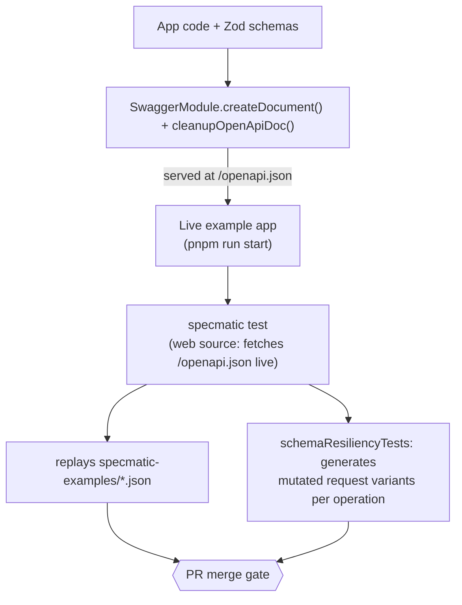

# Specmatic in nestjs-zod

This document explains what this project is, how it works, and how [Specmatic](https://specmatic.io/) contract testing fits into it — what problem existed before it was added, what it solves, and what value (and current gaps) it has.

## 1. What is this project?

`nestjs-zod` is a validation and OpenAPI-generation library for [NestJS](https://nestjs.com/) built on top of [Zod](https://zod.dev/). Instead of maintaining separate `class-validator`/`class-transformer` DTOs and Swagger decorators, you define a single Zod schema and get three things from it automatically:

- **Request validation** — bodies, query params, and route params are validated against the schema.
- **Response serialization** — response payloads are parsed/shaped against the schema before being sent, preventing accidental data leaks.
- **OpenAPI/Swagger documentation** — the same schema is converted into an OpenAPI spec, so docs can't drift from the validation logic by construction.

It's a pnpm monorepo:

| Package | Purpose |
| --- | --- |
| `packages/nestjs-zod` | The core published library (decorators, pipes, interceptors). |
| `packages/z` | Deprecated extended-Zod package (`@nest-zod/z`), kept for backwards compatibility. |
| `packages/cli` | `nestjs-zod-cli` — a codemod tool that auto-wires the library into an existing NestJS project. |
| `packages/example` | A full reference NestJS app ("Star Wars People/Starships API") demonstrating real usage. |
| `packages/example-dual-zods` | Verifies compatibility when Zod v3 and v4 are both present. |
| `packages/example-esm` | Verifies ESM build output compatibility. |

## 2. Core workflow

The typical way the library is used in a NestJS app:

1. Define a Zod schema and wrap it: `class XDto extends createZodDto(Schema) {}`.
2. Register `ZodValidationPipe` as `APP_PIPE` — every `@Body()`/`@Query()`/`@Param()` typed with a Zod DTO is validated automatically.
3. Register `ZodSerializerInterceptor` as `APP_INTERCEPTOR` (or use the `@ZodResponse({ type: XDto })` decorator, which combines runtime serialization, compile-time return type, and `@ApiResponse` docs in one place).
4. Call `cleanupOpenApiDoc(openApiDoc)` on the document produced by `SwaggerModule.createDocument(...)` before `SwaggerModule.setup(...)` — this normalizes nullable/enum handling for OpenAPI 3.0/3.1.

Because request validation, response shaping, and documentation all read from the *same* Zod schema, they can't disagree with each other by definition — the schema is the single source of truth.

## 3. The example app

`packages/example` is a small "Star Wars People/Starships" API with in-memory mock data (no database) that exercises the library end-to-end. Tracing `GET /api/people/:id`:

- `PeopleController.getPerson` (`packages/example/src/people/people.controller.ts`) validates the `:id` param through a Zod DTO (`GetPersonParams`), applied globally via `ZodValidationPipe`.
- It looks the person up in an in-memory array.
- The response is validated/shaped via `@ZodResponse({ status: 200, type: GetPersonResponse })`.
- A 404 (`NotFoundException`) is caught by a global `HttpExceptionFilter`.
- `main.ts` calls `SwaggerModule.createDocument(...)` then `cleanupOpenApiDoc(...)` to serve live Swagger docs at `/api`, and also exposes the same cleaned-up document as raw JSON at `/openapi.json` (via `SwaggerModule.setup('api', app, doc, { jsonDocumentUrl: 'openapi.json' })`). There is no committed `openapi.json` file in the repo — the spec only ever exists as something the running app serves.

## 4. Architecture before Specmatic

Request handling and documentation generation both derive from the same Zod schemas, but they are two **independent code paths**. Nothing actually confirms that the live HTTP responses a client receives match what `openapi.json` claims to describe, and nothing checks that a change doesn't break API consumers between versions.

## 5. The gap this left

Schema-driven codegen guarantees *internal* consistency — the DTO type, the validation logic, and the generated schema can't disagree, because they're derived from one Zod object. It does **not** guarantee:

- **Runtime truth** — that the documented schema matches what the server actually returns once framework-level behavior (like NestJS's built-in exception formatting) is involved. This repo hit exactly this gap three times: the 404 response for `GET /api/people/:id` had no documented error body, neither POST endpoint documented the 400 validation-error body that `ZodValidationPipe` can return, and once that 400 body *was* documented, its `errors[]` items were still too loosely typed to catch a mismatch in what `path` actually contains. All three are covered in section 7.
- **Backward compatibility** — nothing stopped a future change (renaming a field, tightening a type, removing a property) from silently breaking API consumers.

## 6. What Specmatic adds

Specmatic (`specmatic@^2.50.0`, a JVM-based CLI) is wired into `packages/example`'s CI pipeline via a single mechanism: **the live contract test** (`pnpm run test:contract`). CI starts the example app for real, then runs `specmatic test --testBaseURL=...`. `packages/example/specmatic.yaml` (Specmatic config v3) declares a `web` source pointing at `http://localhost:3001`, with `specs: ["openapi.json"]` resolved against that base URL — so Specmatic fetches the spec fresh from the running app's `/openapi.json` endpoint on every run, never from a committed file. Against that live spec, it does two things:

1. **Replays fixtures.** Every request/response pair in `packages/example/specmatic-examples/*.json` is sent as a real HTTP call, and the actual response is asserted to structurally match what the live OpenAPI document says it should be.
2. **Generates its own negative tests.** `specmatic.settings.test.schemaResiliencyTests: "all"` in the same config file turns on mutation-based testing: for every operation, Specmatic also builds mutated request variants (wrong field types, boundary-length strings, invalid enum values) beyond anything in `specmatic-examples/`, and checks that the resulting error responses still match the documented schema.

Both a CI staleness check (which used to regenerate a committed `openapi.json` via a `scripts/generate-openapi.ts` script and diff it against the file on disk) and a `specmatic backward-compatibility-check` step (which diffed the spec on a PR branch against `origin/main`) existed at earlier points in this integration's history. Both were removed once the contract test moved onto the live-served spec — there is no committed `openapi.json` left for either of them to read or diff against; see section 9.

This mechanism has caught real bugs via both replayed fixtures and generated resiliency tests — see section 7 for the cases found so far.

## 7. Case studies: gaps Specmatic actually caught

### 7.1 The undocumented 404 (commit `4009735`)

`GET /api/people/:id` throws `NotFoundException` when a person isn't found, which NestJS serializes as `{ message, error, statusCode }`. Nothing in the controller's `@ApiResponse` decorators described this, so `openapi.json` under-documented a real response shape. `specmatic test` replayed a `GET /api/people/9999` fixture, got back a body the spec didn't describe, and failed. The fix added the missing schema to `@ApiResponse` on `getPerson` and a matching fixture, `specmatic-examples/get-person-by-id-not-found.json`.

### 7.2 The undocumented 400 (this change)

**Why it existed:** `ZodValidationPipe` is registered globally as `APP_PIPE` in `app.module.ts`, so every route with a Zod-validated body/query/param can reject a request. On failure it throws `ZodValidationException` (`packages/nestjs-zod/src/exception.ts`), which returns `{ statusCode: 400, message: 'Validation failed', errors: [...] }`. Grepping the committed `openapi.json` for `"400"` returned zero matches — the exact same class of gap as the 404 case (a framework/library-level runtime behavior the OpenAPI doc didn't describe), just not yet caught, because no fixture had ever exercised it.

**Scoping it:** not every endpoint can actually produce a 400. `GetPersonParams` (`GET /api/people/:id`) is `z.string().transform(val => parseInt(val))` — the transform never throws, so a non-numeric `id` just becomes `NaN` and falls through to the existing 404 path, not a 400. `PersonFilterDto` (`GET /api/people`'s query) is all-optional fields, making it an awkward, non-deterministic trigger. Only the two POST endpoints — `POST /api/people` (`CreatePersonFormDto`) and `POST /api/starships` (`CreateStarshipFormDto`) — reliably 400 on invalid input, since both have many required fields. The fix was scoped to those two.

**What changed:**

- Added `@ApiResponse({ status: 400, ... })` to `createPerson` (`people.controller.ts`) and `createStarship` (`starships.controller.ts`), documenting the `{ statusCode, message, errors }` shape.
- Regenerated `openapi.json` via `generate:openapi` (this script and the committed file it wrote have since been removed — see section 9; at the time, the contract test still read from that file).
- Added two fixtures, `specmatic-examples/create-person-validation-error.json` and `create-starship-validation-error.json`. Their `errors` arrays aren't hand-written guesses — the exact Zod v4 issue shape was captured by starting the app and POSTing a real invalid body (an out-of-enum `gender`; a body missing `starshipClass`) and copying the actual response verbatim.

**How Specmatic helped:** `specmatic test` replays these two fixtures against the live app and structurally validates the actual 400 response against the OpenAPI schema — the same mechanism that caught the 404 gap, now exercising a second undocumented runtime behavior. Running `pnpm run test:contract` after the fix confirmed all 23 scenarios pass with 100% API coverage, including `/api/people POST 400 covered` and `/api/starships POST 400 covered` — evidence the documented shape now matches what the server actually returns, rather than an assumption that it does.

### 7.3 The under-specified `errors[]` shape (commit `f77bb2d`)

**Why it existed:** the `@ApiResponse` schemas added in 7.2 documented `errors` only as `{ type: 'array', items: { type: 'object' } }` — no `properties` at all. That's not wrong, exactly, but it's uninformative enough that it hid a real gap: it says nothing about what a Zod issue's `path` actually contains.

**What found it:** once `schemaResiliencyTests: "all"` was turned on (see section 6), running `pnpm run test:contract` failed 138 of 543 scenarios. Specmatic's generated mutations send the create-person/create-starship array fields (`filmIds`, `pilotIds`, `speciesIds`, `vehicleIds`, `starshipIds`) invalid item types, and Zod's resulting validation error puts the array index as a *number* inside `path` — e.g. `["filmIds", 0]`, not just strings. Length-violation errors (`too_small`/`too_big`) add further fields — `origin`, `minimum`/`maximum`, `inclusive` — and enum violations add `values`. None of that was documented, so Specmatic flagged every mutated case as a schema mismatch.

**What changed:** the `errors[]` item schema on both `@ApiResponse({ status: 400, ... })` blocks was filled in with the real shape — `path` items typed as `string | integer`, plus `code`, `message`, `expected`, `values`, `origin`, `minimum`, `maximum`, `inclusive` — verified against the running app's actual responses, not guessed. `pnpm run test:contract` went from 405/543 to 542/542 passing.

**How Specmatic helped:** this is a different kind of catch than 7.1/7.2. Those were found because a *specific, hand-picked* fixture request exercised an undocumented path. This one had no fixture at all — `schemaResiliencyTests` found it by systematically mutating every field on every operation, which is exactly the coverage a fixed set of hand-written examples can't provide.

## 8. Architecture with Specmatic (CI pipeline)

There is no committed spec file anywhere in this diagram — the only mechanism left is the contract test, checking two things against the live doc: hand-picked fixtures, and Specmatic's own generated mutations.

## 9. Current state

Only one of the mechanisms section 6 describes is active: the live contract test, now running with `schemaResiliencyTests: "all"` on. This is narrower in one sense (no backward-compatibility check protecting consumers between versions — see below) but broader in another (resiliency testing covers every operation, not just the fixtures someone thought to write). `specmatic-examples/` still contains the same four hand-written fixtures: the 200/404 pair for `GET /api/people/:id`, plus the two 400 validation-error fixtures from section 7.2.

This design went through several changes to get here, in order: a committed, hand-maintained `openapi.json` plus a staleness/drift check plus a backward-compatibility check (section 6's original three); then the staleness check and the file's regeneration script were removed, leaving a static file kept in sync by hand; then the contract test itself was moved onto the live-served `/openapi.json` endpoint (Specmatic config v3, `web` source) instead of the file — which immediately surfaced that an earlier commit had quietly stripped the very decorators section 7 describes adding (`getPerson`'s 404 `@ApiResponse`, `createPerson`/`createStarship`'s 400 `@ApiResponse`, several explicit `status:` values on `@ZodResponse`), leaving the live app's generated doc weaker than the hand-maintained file it used to be compared against — those decorators were restored so the fixtures pass against runtime truth again; then the committed file itself was deleted outright, since nothing read it anymore; a same-day attempt to keep the backward-compatibility check alive by curling the live spec into a local file before diffing it was tried and reverted a few minutes later, judged not worth the added CI complexity. `schemaResiliencyTests` was turned on partway through this sequence and is what caught the gap in section 7.3.

This is a factual snapshot of the repo's current state, not a permanent design decision — the backward-compatibility check in particular could come back in some form if protecting consumers between versions becomes a priority again.

## 10. Value assessment

`nestjs-zod` itself is a library, not a deployed HTTP service, so it has no REST "contract" of its own to protect — running Specmatic against the library directly wouldn't make sense. Applying it to `packages/example` instead is a reasonable proxy: it's a real, running NestJS app built with this library's decorators and pipes, so testing it end-to-end exercises `cleanupOpenApiDoc` and the `@ZodResponse`/`ZodSerializerInterceptor` pipeline exactly as a real consumer would experience it.

The value it adds is genuine, not cosmetic:

- It has caught three real bugs (the undocumented 404 shape, the undocumented 400 shape, and the under-specified `errors[]` item shape — section 7) that Zod-schema-driven codegen alone could not have caught, because all three were framework/library-level runtime behavior, not schema-authoring errors.
- `schemaResiliencyTests` closes a second, distinct gap — it doesn't depend on someone having written a fixture for a given failure mode, which is exactly how the section 7.3 bug (present since 13618d6) went uncaught for as long as it did.

A gap that existed for a while and has since been closed: a backward-compatibility check (protecting API consumers from breaking changes between versions) was part of this integration at earlier points but is not currently wired into CI — see section 9. Schema-driven generation still has no mechanism to detect that on its own.

The main residual gap: fixture-based coverage still depends on which fixtures exist, even though resiliency testing now covers per-field mutations broadly. `GET /api/people/:id`'s 404 and both POST endpoints' 400s are covered by dedicated fixtures, but nothing yet exercises `PersonFilterDto`'s query validation path as a *scenario*, since (per section 7.2) it has no clean, deterministic invalid input to fixture.

## 11. Shipping this value beyond `packages/example`

Everything above only protects this repo's own reference app. `nestjs-zod-cli` (`packages/cli`) — the codemod tool behind the README's "Automatic Setup" (`npx nestjs-zod-cli /path/to/nestjs/project`) — installs `specmatic` as a devDependency, creates a `specmatic.yaml`, and adds a `test:contract` script for consumer projects when swagger/OpenAPI generation is set up; OpenAPI/spec generation itself is still left entirely to the consumer's own app code (the same `SwaggerModule.createDocument` + `cleanupOpenApiDoc` call documented in section 2), following the pattern documented in section 2.

**This mirrors `packages/example`'s live-web setup, not a simplified filesystem-based copy of it.** The CLI's swagger codemod (`swaggerTransform.js`) wires up `SwaggerModule.setup('api', app, cleanupOpenApiDoc(openApiDoc), { jsonDocumentUrl: 'openapi.json' })` — the same `jsonDocumentUrl` option `packages/example`'s `main.ts` adds by hand — so a CLI-scaffolded app serves its OpenAPI spec live at `/openapi.json` out of the box. The generated `specmatic.yaml.template` declares a `web` source (`{ web: { url: "http://localhost:3000" } }`) pointing at that endpoint, matching NestJS's default port and the `--testBaseURL=http://localhost:3000` baked into the scaffolded `test:contract` script. There is no committed `openapi.json` file involved anywhere in the CLI-scaffolded setup, same as `packages/example`.

A consumer whose app listens on a different port needs to update both `specmatic.yaml`'s `url` and the `test:contract` script's `--testBaseURL` to match. They'll also want to populate a `specmatic-examples/` fixtures directory by hand — the CLI only creates the config that references that directory, not the fixtures themselves — and can leave `schemaResiliencyTests` on by default (already on in the scaffolded config; see section 7.3 for why that setting is worth keeping).
