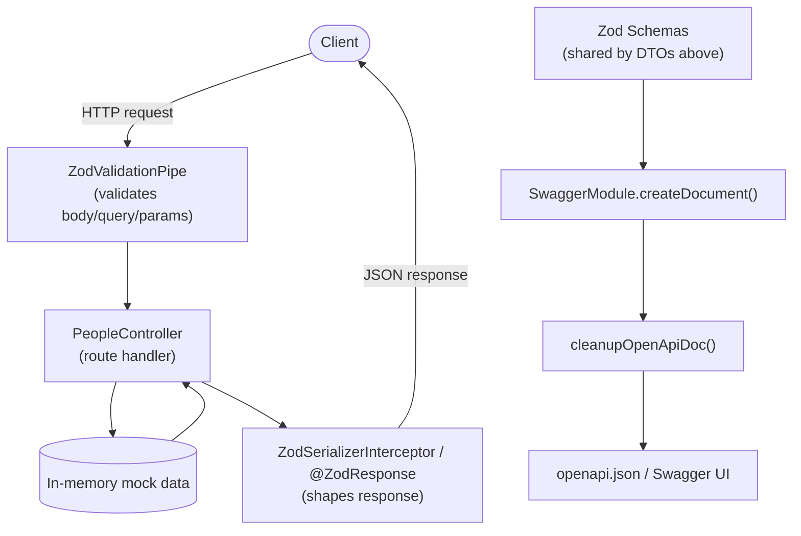
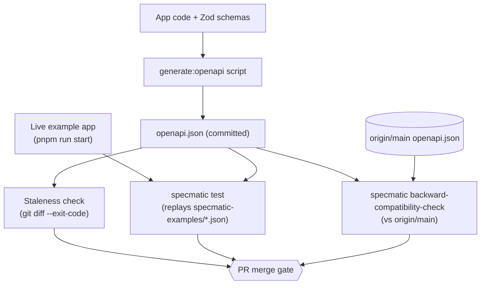

# Specmatic in nestjs-zod

This document explains what this project is, how it works, and how [Specmatic](https://specmatic.io/) contract testing fits into it — what problem existed before it was added, what it solves, and what value (and current gaps) it has.

## 1. What is this project?

`nestjs-zod` is a validation and OpenAPI-generation library for [NestJS](https://nestjs.com/) built on top of [Zod](https://zod.dev/). Instead of maintaining separate `class-validator`/`class-transformer` DTOs and Swagger decorators, you define a single Zod schema and get three things from it automatically:

- **Request validation** — bodies, query params, and route params are validated against the schema.
- **Response serialization** — response payloads are parsed/shaped against the schema before being sent, preventing accidental data leaks.
- **OpenAPI/Swagger documentation** — the same schema is converted into an OpenAPI spec, so docs can't drift from the validation logic by construction.

It's a pnpm monorepo:

| Package | Purpose |
| --- | --- |
| `packages/nestjs-zod` | The core published library (decorators, pipes, interceptors). |
| `packages/z` | Deprecated extended-Zod package (`@nest-zod/z`), kept for backwards compatibility. |
| `packages/cli` | `nestjs-zod-cli` — a codemod tool that auto-wires the library into an existing NestJS project. |
| `packages/example` | A full reference NestJS app ("Star Wars People/Starships API") demonstrating real usage. |
| `packages/example-dual-zods` | Verifies compatibility when Zod v3 and v4 are both present. |
| `packages/example-esm` | Verifies ESM build output compatibility. |

## 2. Core workflow

The typical way the library is used in a NestJS app:

1. Define a Zod schema and wrap it: `class XDto extends createZodDto(Schema) {}`.
2. Register `ZodValidationPipe` as `APP_PIPE` — every `@Body()`/`@Query()`/`@Param()` typed with a Zod DTO is validated automatically.
3. Register `ZodSerializerInterceptor` as `APP_INTERCEPTOR` (or use the `@ZodResponse({ type: XDto })` decorator, which combines runtime serialization, compile-time return type, and `@ApiResponse` docs in one place).
4. Call `cleanupOpenApiDoc(openApiDoc)` on the document produced by `SwaggerModule.createDocument(...)` before `SwaggerModule.setup(...)` — this normalizes nullable/enum handling for OpenAPI 3.0/3.1.

Because request validation, response shaping, and documentation all read from the *same* Zod schema, they can't disagree with each other by definition — the schema is the single source of truth.

## 3. The example app

`packages/example` is a small "Star Wars People/Starships" API with in-memory mock data (no database) that exercises the library end-to-end. Tracing `GET /api/people/:id`:

- `PeopleController.getPerson` (`packages/example/src/people/people.controller.ts`) validates the `:id` param through a Zod DTO (`GetPersonParams`), applied globally via `ZodValidationPipe`.
- It looks the person up in an in-memory array.
- The response is validated/shaped via `@ZodResponse({ status: 200, type: GetPersonResponse })`.
- A 404 (`NotFoundException`) is caught by a global `HttpExceptionFilter`.
- `main.ts` calls `SwaggerModule.createDocument(...)` then `cleanupOpenApiDoc(...)` to serve live Swagger docs at `/api`. A companion script, `scripts/generate-openapi.ts`, runs the same logic to write a static `openapi.json` to the package root.

## 4. Architecture before Specmatic

Request handling and documentation generation both derive from the same Zod schemas, but they are two **independent code paths**. Nothing actually confirms that the live HTTP responses a client receives match what `openapi.json` claims to describe, and nothing checks that a change doesn't break API consumers between versions.

## 5. The gap this left

Schema-driven codegen guarantees *internal* consistency — the DTO type, the validation logic, and the generated schema can't disagree, because they're derived from one Zod object. It does **not** guarantee:

- **Runtime truth** — that the documented schema matches what the server actually returns once framework-level behavior (like NestJS's built-in exception formatting) is involved. This repo hit exactly this gap twice: the 404 response for `GET /api/people/:id` had no documented error body, and (separately) neither POST endpoint documented the 400 validation-error body that `ZodValidationPipe` can return. Both are covered in section 7.
- **Backward compatibility** — nothing stopped a future change (renaming a field, tightening a type, removing a property) from silently breaking API consumers.

## 6. What Specmatic adds

Specmatic (`specmatic@^2.50.0`, a JVM-based CLI) is wired into `packages/example`'s CI pipeline via three mechanisms:

1. **Staleness check** — CI regenerates `openapi.json` via `generate:openapi` and runs `git diff --exit-code`, failing if the committed spec doesn't match what the code currently produces.
2. **Contract test** (`pnpm run test:contract`) — starts the example app for real, then runs `specmatic test openapi.json --testBaseURL=... --examples=specmatic-examples`, replaying fixture requests (`packages/example/specmatic-examples/*.json`) and asserting the *actual* HTTP responses conform to the documented OpenAPI schema.
3. **Backward-compatibility check** — `specmatic backward-compatibility-check --base-branch=origin/main --target-path=packages/example/openapi.json`, introduced in commit `2ffb869`, diffs the spec on a PR branch against `origin/main` and fails if the change is not backward-compatible.

Mechanism 2 is what has caught real bugs — see section 7 for both cases found so far.

## 7. Case studies: gaps Specmatic actually caught

### 7.1 The undocumented 404 (commit `4009735`)

`GET /api/people/:id` throws `NotFoundException` when a person isn't found, which NestJS serializes as `{ message, error, statusCode }`. Nothing in the controller's `@ApiResponse` decorators described this, so `openapi.json` under-documented a real response shape. `specmatic test` replayed a `GET /api/people/9999` fixture, got back a body the spec didn't describe, and failed. The fix added the missing schema to `@ApiResponse` on `getPerson` and a matching fixture, `specmatic-examples/get-person-by-id-not-found.json`.

### 7.2 The undocumented 400 (this change)

**Why it existed:** `ZodValidationPipe` is registered globally as `APP_PIPE` in `app.module.ts`, so every route with a Zod-validated body/query/param can reject a request. On failure it throws `ZodValidationException` (`packages/nestjs-zod/src/exception.ts`), which returns `{ statusCode: 400, message: 'Validation failed', errors: [...] }`. Grepping the committed `openapi.json` for `"400"` returned zero matches — the exact same class of gap as the 404 case (a framework/library-level runtime behavior the OpenAPI doc didn't describe), just not yet caught, because no fixture had ever exercised it.

**Scoping it:** not every endpoint can actually produce a 400. `GetPersonParams` (`GET /api/people/:id`) is `z.string().transform(val => parseInt(val))` — the transform never throws, so a non-numeric `id` just becomes `NaN` and falls through to the existing 404 path, not a 400. `PersonFilterDto` (`GET /api/people`'s query) is all-optional fields, making it an awkward, non-deterministic trigger. Only the two POST endpoints — `POST /api/people` (`CreatePersonFormDto`) and `POST /api/starships` (`CreateStarshipFormDto`) — reliably 400 on invalid input, since both have many required fields. The fix was scoped to those two.

**What changed:**

- Added `@ApiResponse({ status: 400, ... })` to `createPerson` (`people.controller.ts`) and `createStarship` (`starships.controller.ts`), documenting the `{ statusCode, message, errors }` shape.
- Regenerated `openapi.json` via `generate:openapi`.
- Added two fixtures, `specmatic-examples/create-person-validation-error.json` and `create-starship-validation-error.json`. Their `errors` arrays aren't hand-written guesses — the exact Zod v4 issue shape was captured by starting the app and POSTing a real invalid body (an out-of-enum `gender`; a body missing `starshipClass`) and copying the actual response verbatim.

**How Specmatic helped:** `specmatic test` replays these two fixtures against the live app and structurally validates the actual 400 response against the OpenAPI schema — the same mechanism that caught the 404 gap, now exercising a second undocumented runtime behavior. Running `pnpm run test:contract` after the fix confirmed all 23 scenarios pass with 100% API coverage, including `/api/people POST 400 covered` and `/api/starships POST 400 covered` — evidence the documented shape now matches what the server actually returns, rather than an assumption that it does.

## 8. Architecture with Specmatic (CI pipeline)

## 9. Current state

All three CI mechanisms from section 6 are active: the staleness check, the live contract test, and the backward-compatibility check against `origin/main`. `specmatic-examples/` contains four fixtures: the original 200/404 pair for `GET /api/people/:id`, plus the two 400 validation-error fixtures from section 7.2. This is a factual snapshot of the repo's current state, not a permanent design decision.

## 10. Value assessment

`nestjs-zod` itself is a library, not a deployed HTTP service, so it has no REST "contract" of its own to protect — running Specmatic against the library directly wouldn't make sense. Applying it to `packages/example` instead is a reasonable proxy: it's a real, running NestJS app built with this library's decorators and pipes, so testing it end-to-end exercises `cleanupOpenApiDoc` and the `@ZodResponse`/`ZodSerializerInterceptor` pipeline exactly as a real consumer would experience it.

The value it adds is genuine, not cosmetic:

- It has caught two real bugs (the undocumented 404 and 400 shapes, section 7) that Zod-schema-driven codegen alone could not have caught, because both mismatches were framework/library-level runtime behavior, not schema-authoring errors.
- The backward-compatibility-check step closes a second, distinct gap — protecting API consumers from breaking changes — which schema-driven generation has no mechanism to detect on its own.

The main residual gap: coverage depends entirely on which fixtures exist. `GET /api/people/:id`'s 404 and both POST endpoints' 400s are now covered, but nothing yet exercises `PersonFilterDto`'s query validation path, since (per section 7.2) it has no clean, deterministic invalid input to fixture.
